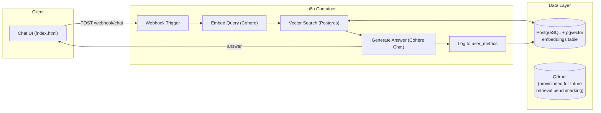
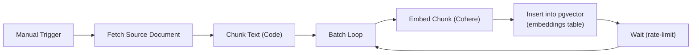
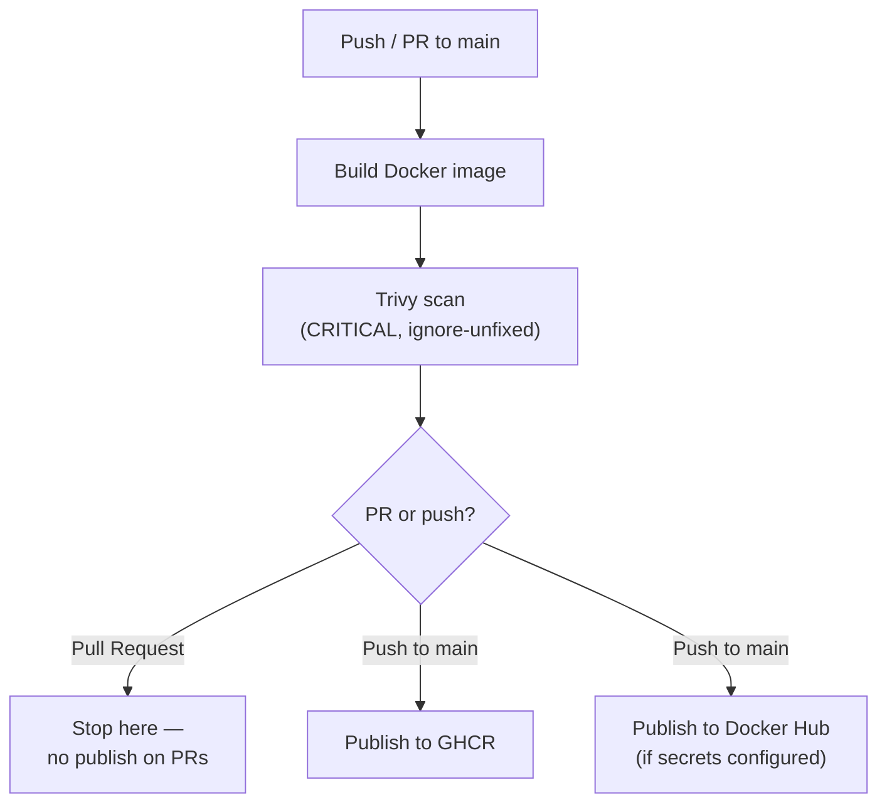

# n8n RAG Metrics

A self-hosted, security-hardened Retrieval-Augmented Generation (RAG) chatbot built on **n8n**, **PostgreSQL/pgvector**, and **Cohere**, shipped through a **DevSecOps pipeline** that scans every container image for vulnerabilities before it's published.

[](https://github.com/ShreyashLondhe31/n8n-RAG-metrics/actions)


---

## What this is

A working RAG chatbot where every user query and AI response is logged for observability — hence "metrics." Ask it a question, it embeds the query, pulls the closest matching chunks from a vector store, and generates a grounded answer with Cohere. The interesting part isn't the chatbot itself — it's how the whole thing is built, secured, and shipped:

- Every container runs as a **non-root user** with **all Linux capabilities dropped** and **no-new-privileges**.
- Every image is **scanned for critical vulnerabilities with Trivy** before it's allowed to publish.
- Every change to `main` requires a **code-owner-reviewed pull request** — enforced even for admins.
- Secrets never touch version control; everything sensitive is `.env`-based and gitignored.

## Architecture



## Document ingestion pipeline



Each chunk is embedded with Cohere's `embed-v3` and stored as a native `vector` column in Postgres. At query time, the Chat API workflow ranks candidates with pgvector's cosine-distance operator (`<=>`) and takes the top 5 matches before handing them to Cohere's chat model as context.

## DevSecOps pipeline — step by step



1. **Build** — every push and pull request builds the image fresh from the `Dockerfile`, so a broken build fails loudly before anything else runs.
2. **Scan** — [Trivy](https://github.com/aquasecurity/trivy) scans the built image for CRITICAL, fixable vulnerabilities. Results are uploaded as workflow artifacts (JSON + human-readable table) so they're reviewable after the fact, not just a pass/fail flag.
3. **Gate** — publishing jobs declare `needs: security-scan`, so a failed or skipped scan blocks the image from ever reaching a registry.
4. **Publish** — on pushes to `main` only (never on PRs), the image is pushed to GitHub Container Registry (`ghcr.io`); it's additionally pushed to Docker Hub if `DOCKERHUB_USERNAME`/`DOCKERHUB_TOKEN` secrets are present, and skipped cleanly otherwise.
5. **Govern** — `main` is protected by branch rules requiring at least one **code owner** approval (`.github/CODEOWNERS`) on every pull request, enforced for administrators too. A helper script (`.github/scripts/setup-branch-protection.sh`) configures this via the GitHub API so the policy is reproducible, not a manual click-through.

## Container hardening

| Control | Where | Why it matters |
|---|---|---|
| Non-root user (`1000:1000`) | `n8n` service | A container compromise doesn't hand over root inside the container |
| `cap_drop: ALL` | Every service | Removes Linux capabilities the app doesn't need (raw sockets, module loading, etc.) |
| `no-new-privileges` | Every service | Blocks privilege escalation via setuid binaries |
| `read_only: true` + `tmpfs /tmp` | `n8n` service | Filesystem can't be tampered with at runtime; only `/tmp` is writable, and it's memory-backed |
| Ports bound to `127.0.0.1` | All services | Nothing is reachable from outside the host by default |
| Healthchecks | `n8n`, `db` | Orchestrator can detect and restart a wedged container automatically |
| Secrets via `.env` | All services | Credentials never enter git history (`.gitignore` + `.dockerignore` both exclude it) |

## Tech stack

`n8n` · `PostgreSQL (pgvector)` · `Qdrant` · `Cohere (Embed v3 + Command chat)` · `Docker` · `Docker Compose` · `GitHub Actions` · `Trivy` · `GitHub Container Registry`

## Project structure

```
.
├── .github/
│   ├── workflows/ci-cd.yml         # Build → Trivy scan → publish (GHCR / Docker Hub)
│   ├── scripts/setup-branch-protection.sh
│   ├── branch-protection.md
│   └── CODEOWNERS
├── Dockerfile                      # Hardened, non-root n8n image
├── docker-compose.yml              # n8n + Postgres(pgvector) + Qdrant, all hardened
├── RAG__Document_Ingestion.json    # n8n workflow: fetch → chunk → embed → store
├── Chat_API.json                   # n8n workflow: embed → search → generate → log
├── index.html                      # Minimal chat UI
├── .env                            # Local secrets (gitignored, not committed)
└── README.md
```

## Running it locally

```bash
# 1. Create your .env with POSTGRES_*, N8N_* credentials (see docker-compose.yml for the full list)
# 2. Start the stack
docker compose up --build
```

n8n comes up at `http://localhost:5678` (basic-auth protected). Import `RAG__Document_Ingestion.json` and run it once to populate the `embeddings` table, then import and activate `Chat_API.json` to expose the `/webhook/chat` endpoint used by `index.html`.

> **Note:** `docker images` reports an image's *virtual* size, which includes shared base layers. Check the actual payload with `docker image inspect local/n8n-rag-metrics:optimized --format '{{.Size}}'`.

## What's next

- Wire the already-provisioned Qdrant instance into the Chat API workflow to A/B the retrieval quality against pgvector — the "metrics" table already logs every query/response, so this becomes a real comparison rather than a guess.
- Add automated tests for the ingestion and chat workflows.

## Author

**Shreyash Londhe** — Application Security / DevSecOps
[LinkedIn](https://www.linkedin.com/in/shreyashlondhe) · [GitHub](https://github.com/ShreyashLondhe31)
